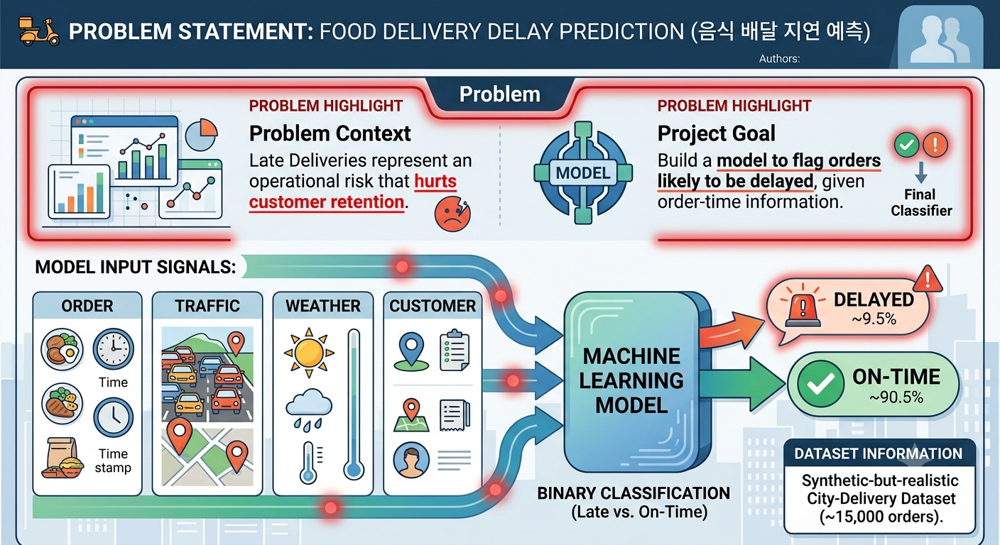
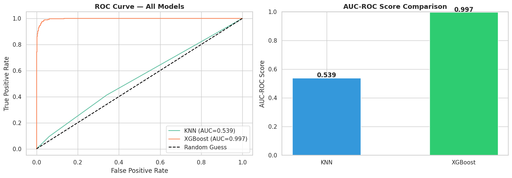
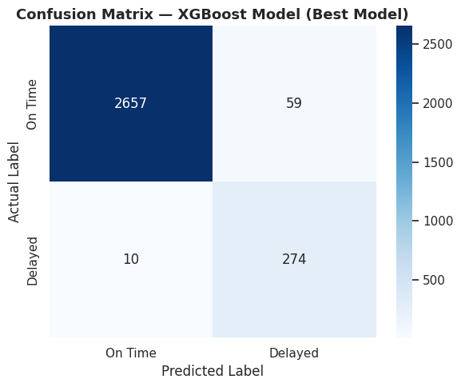
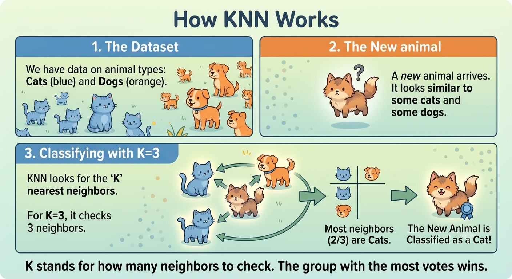
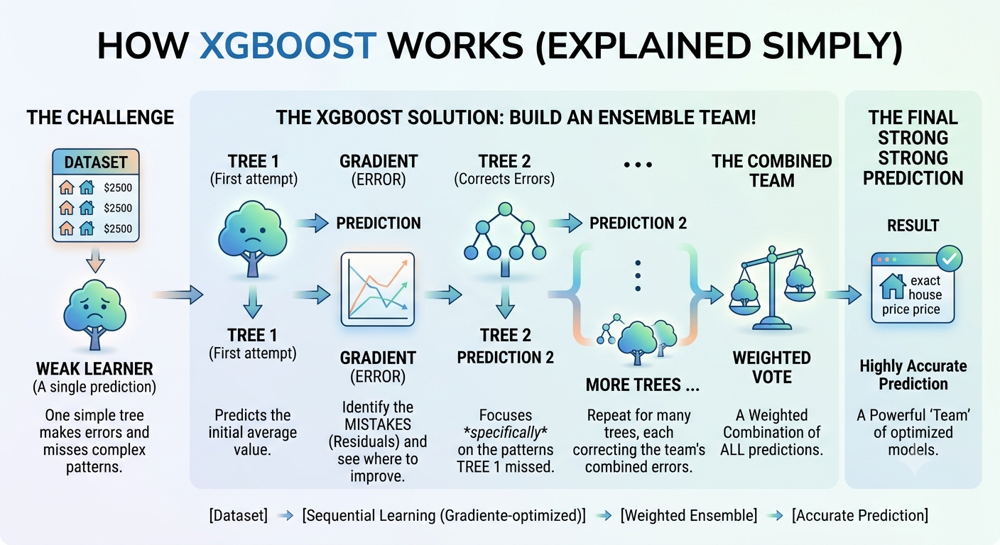
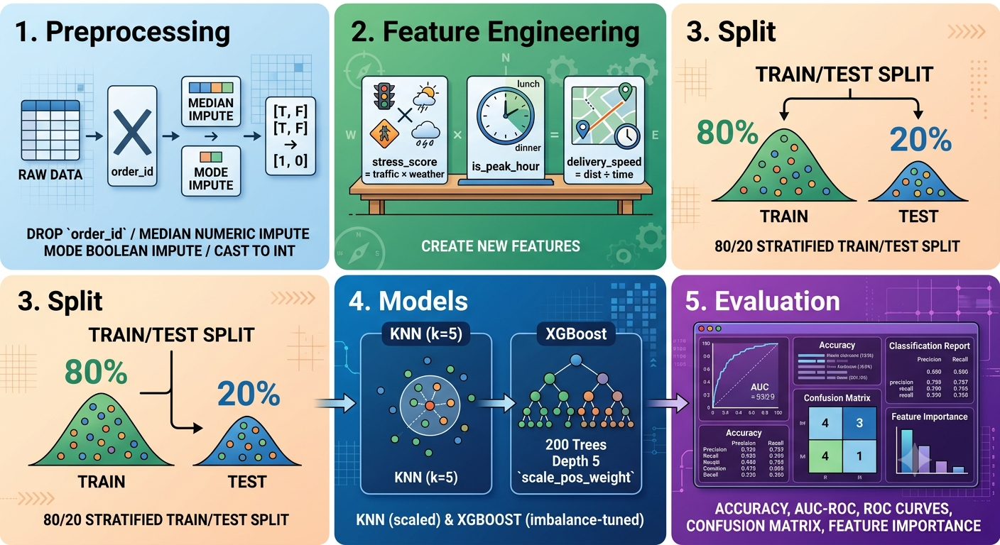

# 🛵 Food Delivery Delay Prediction (음식 배달 지연 예측)

Machine-learning project that predicts whether a food order will be delivered late,
based on order, traffic, weather, and customer signals. Binary classification on a
synthetic-but-realistic city-delivery dataset (~15,000 orders, ~9.5% delayed).

Authors: 서정우

## Overview
 
This project predicts whether a food delivery will arrive late, using details available
at order time (distance, traffic, weather, time of day). It's a binary classification
task — the model outputs "on-time" or "delayed" for each order.
 
Two models are compared: a simple baseline (KNN) and a more powerful model (XGBoost).
XGBoost wins by a wide margin, especially at catching the rare "delayed" cases — the harder
and more operationally important class to predict.

## Problem
<p align="center">
  
  <br>
  <em>Problem Statement</em>
</p>

Late deliveries are an operational risk that hurts customer retention. The goal is to
build a model that flags orders likely to be delayed, given order-time information.

## Results

XGBoost decisively outperforms KNN. Although KNN's accuracy looks high, its AUC-ROC
(~0.54) shows it barely beats random guessing on the imbalanced minority (delayed) class.

| Model    | Accuracy | AUC-ROC | Delayed F1 |
|----------|:--------:|:-------:|:----------:|
| KNN      |  90.13%  |  0.539  |    0.01    |
| XGBoost | 97.77% | 0.997 | 0.89|

XGBoost handles the 90.5% / 9.5% class imbalance via `scale_pos_weight` and still keeps
high precision and recall on both classes.

XGBoost handles the 90.5% / 9.5% class imbalance via `scale_pos_weight` and still keeps
high precision and recall on both classes.
 
<p align="center">
  
  <br>
  <em>Figure 4: ROC curve — KNN vs XGBoost</em>
</p>
<p align="center">
  
  <br>
  <em>Figure 5: Confusion matrix — XGBoost predictions</em>
</p>
Top predictive features: delivery time, estimated delivery time, delivery speed,
stress score, traffic level.

## How the models work

KNN (K-Nearest Neighbors) — classifies an order by looking at the *k* most similar
past orders (based on distance, traffic, etc.) and taking a majority vote. Simple,
intuitive, but struggles when one class (delayed orders) is rare — it gets outvoted
by the majority class.

<p align="center">
  
  <br>
  <em>Figure 1: KNN</em>
</p>

XGBoost (Gradient Boosted Trees) — builds many small decision trees in sequence,
each one correcting the errors of the last. Handles class imbalance directly via
`scale_pos_weight`, which tells the model to weigh mistakes on the rare "delayed"
class more heavily. This is why it substantially outperforms KNN here.

<p align="center">
  
  <br>
  <em>Figure 2: XGBoost</em>
</p>

Top predictive features: delivery time, estimated delivery time, delivery speed,
stress score, traffic level.

## Repository structure

```
food-delivery-delay-prediction/
├── src/                      # Reproducible pipeline
│   ├── config.py             # Paths, target, split settings
│   ├── data.py               # Load + preprocess (impute, bool→int)
│   ├── features.py           # stress_score, is_peak_hour, delivery_speed
│   ├── train.py              # Split, scale, train KNN + XGBoost, save models
│   └── evaluate.py           # Metrics, ROC, confusion matrix, importances
├── notebooks/
│   └── delivery_delay_analysis.ipynb   # Original exploratory notebook
├── docs/
│   └── presentation.pdf      # Project presentation slides
├── data/                     # Place the dataset here (gitignored)
├── models/                   # Saved model artifacts (gitignored)
├── reports/figures/          # Generated plots
├── requirements.txt
├── LICENSE
└── README.md
```

## Dataset

This project uses the Food Delivery Operations and Customer Analytics dataset from
Kaggle. It is not committed to the repo (it's gitignored).

1. Download `food_delivery_analytics_cleaned.csv` from Kaggle.
2. Place it in the `data/` folder:
   ```
   data/food_delivery_analytics_cleaned.csv
   ```

## Setup

```bash
# (recommended) create a virtual environment
python -m venv .venv
source .venv/bin/activate        # Windows: .venv\Scripts\activate

pip install -r requirements.txt
```

## Usage

```bash
# 1. Train both models (saves artifacts to models/)
python -m src.train

# 2. Evaluate and generate figures (saved to reports/figures/)
python -m src.evaluate
```

Or explore the original analysis interactively:

```bash
jupyter notebook notebooks/delivery_delay_analysis.ipynb
```

## Method summary
<p align="center">
  
  <br>
  <em>Figure 3: Contents</em>
</p>

1. Preprocessing — drop `order_id`, median-impute numeric NaNs, mode-impute boolean
   NaNs, cast booleans to int.
2. Feature engineering — `stress_score` (traffic × weather), `is_peak_hour`
   (lunch/dinner windows), `delivery_speed` (distance ÷ time).
3. Split — 80/20 stratified train/test.
4. Models — KNN (k=5, on scaled features) and XGBoost (200 trees, depth 5,
   `scale_pos_weight` for imbalance).
5. Evaluation — accuracy, AUC-ROC, classification report, ROC curves, confusion
   matrix, and feature importance.

## License

MIT — see [LICENSE](LICENSE).
